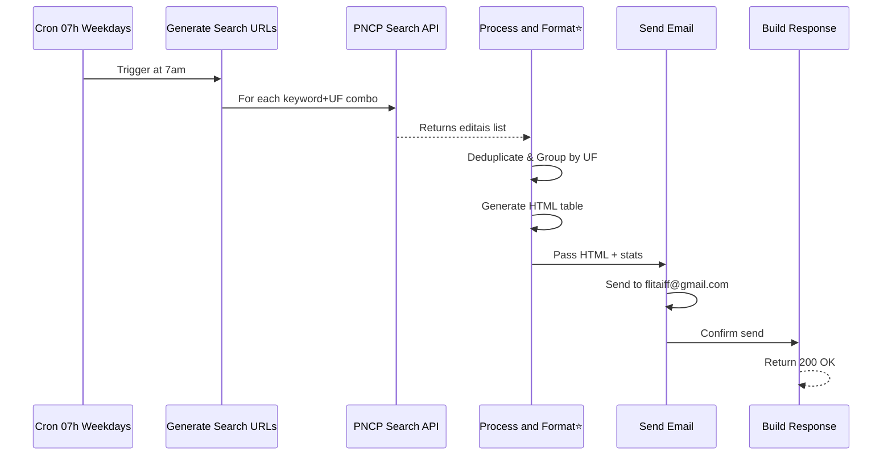

# PNCP Daily Monitor Workflow Analysis

## Workflow Summary

**Workflow ID:** `2X9z2xw7jjl6vvJY`  
**Name:** PNCP Daily Monitor  
**Status:** Inactive (archived)  
**Total Nodes:** 10  

---

## Node Hierarchy

```
Cron 07h Weekdays (Trigger)
    ↓
Generate Search URLs (Code Node)
    ↓
PNCP Search API (HTTP Request)
    ↓
Process and Format (Code Node) ⭐ EMAIL HTML GENERATOR
    ↓
Send Email (Email Node)
    ↓
Build Response (Code Node)
    ↓
Respond OK (Webhook Response)

[Parallel Branch:]
Webhook Manual (Webhook Trigger)
    ↓
Check Auth (IF node)
    ├→ Generate Search URLs (on auth success)
    └→ Respond Unauthorized (on auth failure)
```

---

## Key Nodes for Portal Integration

### 1. Process and Format Node (EMAIL HTML GENERATOR)
**Node ID:** `edddb287-bc0f-4219-a2cf-d6ebae44ac1d`  
**Type:** `n8n-nodes-base.code` (v2)  
**Purpose:** Generates HTML email content with formatted PNCP editais table  

**Current Content:**
- Processes API responses from PNCP search
- Deduplicates editais by `id_pncp`
- Groups results by UF (state)
- Generates HTML table with:
  - Órgão (Agency)
  - Objeto (Object/Title)
  - Encerramento (Deadline)
  - Valor Est. (Estimated Value)
  - Ações (Actions) - Links to PNCP and documents

**HTML Generation Section (Lines 54-92):**
```javascript
let html = `<div style="font-family:'Segoe UI',Arial,sans-serif;...">`;
// ... header, stats ...
// For each UF:
html += `<h2>... ${uf} — ${items.length} editais ...</h2>`;
html += `<table>...`;
// For each edital:
html += `<a href="${item.link_pncp}">Ver PNCP</a>`;
html += `<a href="${item.link_arquivos_api}">Documentos</a>`;
```

**Key URLs in Code:**
- Line 26: `link_pncp: 'https://pncp.gov.br/app/editais/${item.id}'`
- Line 27: `link_arquivos_api: 'https://pncp.gov.br/pncp-api/v1/orgaos/...'`
- Line 84: `<a href="${item.link_pncp}">Ver PNCP</a>`
- Line 85: `<a href="${item.link_arquivos_api}">Documentos</a>`

**Hardcoded Email Target (Line 97):**
```javascript
email: { to: 'flitaiff@gmail.com', subject: `[PNCP] ${unique.length} editais abertos — ${hojeStr}`, html: html }
```

---

### 2. Send Email Node
**Node ID:** `1cb3933a-768f-4b2d-9a53-61009c425c07`  
**Type:** `n8n-nodes-base.emailSend` (v2.1)  

**Configuration:**
```
From Email: flitaiff@gmail.com
To Email: ={{$json.email.to}}
Subject: ={{$json.email.subject}}
HTML: ={{$json.email.html}}
Credentials: SMTP account (TAZ8C6Oo3qLTak9d)
```

---

### 3. Generate Search URLs Node (Reference)
**Node ID:** `04e5d1ba-1db5-4799-8287-f9637361a795`  
**Type:** `n8n-nodes-base.code` (v2)  

Generates search URL list for keywords and UFs:
```javascript
const keywords = [
  'ar-condicionado', 'computador', 'microcomputador', 'notebook',
  'tablet', 'chromebook', 'desktop', 'GED', 'microfilmagem',
  'digitalizacao', 'gestao de documentos', 'gestao documental',
  'estacao de trabalho', 'escanerizacao',
  'licenciamento de softwares Microsoft',
  'indexacao de documentos', 'microfilme'
];
const ufs = ['RJ', 'SP', 'MG', 'BA', 'PE', 'DF'];
```

---

## Changes Needed for Portal Integration

### Issue: Email URLs Missing Portal Links
The workflow generates PNCP editais emails but **does NOT include links to `/iatr/edital` in the portal**.

### Required Modifications

**In Node: "Process and Format" (Node ID: `edddb287-bc0f-4219-a2cf-d6ebae44ac1d`)**

#### Change 1: Add Portal Link to Edital Object (around line 20-30)
```javascript
// Current:
link_pncp: `https://pncp.gov.br/app/editais/${item.id || ''}`,

// Add portal link:
link_portal_edital: item.id ? `/iatr/edital?id=${item.numero_controle_pncp}` : '',
```

#### Change 2: Add Portal Link Button to HTML Table (line 84-85)
```javascript
// Current:
html += `<td style="padding:10px;text-align:center;vertical-align:top"><a href="${item.link_pncp}" style="display:inline-block;background:#2980b9;color:#fff;padding:5px 12px;border-radius:4px;text-decoration:none;font-size:11px;margin:2px">Ver PNCP</a>`;
if (item.link_arquivos_api) html += `<br/><a href="${item.link_arquivos_api}" style="display:inline-block;background:#27ae60;color:#fff;padding:5px 12px;border-radius:4px;text-decoration:none;font-size:11px;margin:2px">Documentos</a>`;

// Add portal button:
html += `<td style="padding:10px;text-align:center;vertical-align:top">`;
html += `<a href="${item.link_pncp}" style="display:inline-block;background:#2980b9;color:#fff;padding:5px 12px;border-radius:4px;text-decoration:none;font-size:11px;margin:2px">Ver PNCP</a>`;
if (item.link_portal_edital) {
  html += `<br/><a href="${item.link_portal_edital}" style="display:inline-block;background:#8e44ad;color:#fff;padding:5px 12px;border-radius:4px;text-decoration:none;font-size:11px;margin:2px">📊 Analisar</a>`;
}
if (item.link_arquivos_api) html += `<br/><a href="${item.link_arquivos_api}" style="display:inline-block;background:#27ae60;color:#fff;padding:5px 12px;border-radius:4px;text-decoration:none;font-size:11px;margin:2px">Documentos</a>`;
html += `</td>`;
```

#### Change 3: Parametrize Email Address (line 97)
```javascript
// Current (hardcoded):
email: { to: 'flitaiff@gmail.com', subject: `[PNCP] ${unique.length} editais abertos — ${hojeStr}`, html: html }

// Suggested (use workflow variable):
email: { to: process.env.PNCP_EMAIL_TO || 'flitaiff@gmail.com', subject: `[PNCP] ${unique.length} editais abertos — ${hojeStr}`, html: html }
```

---

## Workflow Flow Diagram



---

## Summary

| Aspect | Details |
|--------|---------|
| **Workflow ID** | `2X9z2xw7jjl6vvJY` |
| **Key Node** | Process and Format (`edddb287-bc0f-4219-a2cf-d6ebae44ac1d`) |
| **Change Required** | Add `/iatr/edital` links to HTML email generation |
| **File Affected** | N8N Workflow JSON (via N8N UI) |
| **Current Email To** | Hardcoded `flitaiff@gmail.com` |
| **Portal Integration** | Missing portal analysis links |

